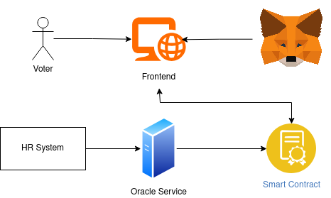
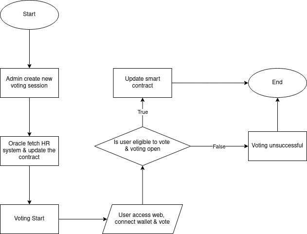

# System DApp Voting

> 🚀 A decentralized voting application composed of three services:
>
> 1. **Smart Contracts** (Solidity & Foundry)
> 2. **Frontend** (Next.js + Wagmi + RainbowKit)
> 3. **Oracle Service** (Express.js)

---

## 📦 Repository Structure

```
system-dapp-voting/
├── contract-dapp-voting           # Solidity smart contracts (submodule)
│   └── ...
├── fe-dapp-voting/                # Next.js frontend application (submodule)
│   └── ...
├── oracle-dapp-voting/            # Oracle client (submodule)
│   └── ...
└── README.md           # (this file)
```

> **Note:** The `contract-dapp-voting/`, `fe-dapp-voting/`, and `oracle-dapp-voting/` folder is a Git submodule.

---

## 🔗 Getting Started

### 1. Clone the repository

```bash
git clone https://github.com/Lev1reG/system-dapp-voting.git
cd system-dapp-voting
```

### 2. Update submodules

The Oracle service is included as a submodule. After cloning, initialize and update:

```bash
git submodule init
git submodule update --init --recursive
```

---

## 🧩 Architecture Overview

Below is a high-level diagram of how the three services interact:



1. **Smart Contracts**

   - Deploy on a testnet (Sepolia).
   - Emit events: `VotingSessionCreated`, `CandidateRegistered`, `Voted`.

2. **Oracle Service** (Express.js)

   - Listens to on-chain events.
   - For `VotingSessionCreated`: fetch HR data → determine eligible voters.
   - For `CandidateRegistered`: save new candidate data to backend.

3. **Frontend (Next.js)**

   - Connects Wallet (RainbowKit + Wagmi).
   - Displays available sessions, candidates, vote counts.
   - Calls `vote(sessionId, candidateAddr)` on-chain.

4. **Backend (Next.js API)**

   - Stores off-chain data if needed (e.g., voter eligibility).

---

## 🗳️ Voting Flow



---

## ⚙️ Quick Setup

### 1. Smart Contracts (Foundry)

1. Install Foundry & dependencies:

   ```bash
   cd contract-dapp-voting
   forge install OpenZeppelin/openzeppelin-contracts
   forge build
   ```

2. Deploy to a testnet:

   ```bash
   forge script script/DeployVoting.s.sol --rpc-url $RPC_URL --private-key $PRIVATE_KEY --broadcast
   ```

3. Note the deployed contract address → set `NEXT_PUBLIC_CONTRACT_ADDRESS` in frontend.

### 2. Frontend (Next.js)

1. Move to `fe-dapp-voting/`:

   ```bash
   cd ../fe-dapp-voting
   npm install
   ```

2. Create `.env`:

   ```
   NEXT_PUBLIC_CONTRACT_ADDRESS=0xYourContractAddress
   ```

3. Start dev server:

   ```bash
   npm run dev
   ```

### 3. Oracle Service

1. Initialize submodule if not done:

   ```bash
   cd ../oracle-dapp-voting
   git submodule init
   git submodule update --init --recursive
   ```

2. Install dependencies:

   ```bash
   npm install
   ```

3. Create `.env`:

   ```
   RPC_URL=https://sepolia.infura.io/v3/[ID]
   PRIVATE_KEY=0xYOUR_ADMIN_PRIVATE_KEY
   CONTRACT_ADDRESS=0xYourContractAddress
   BACKEND_URL=http://localhost:3000
   ```

4. Run Oracle:

   ```bash
   npm run dev
   ```

---

## 👥 Developers

- **Benaya Imanuela** (Student ID: 22/494790/TK/54313)
- **Deren Tanaphan** (Student ID: 22/503261/TK/54976)

---
